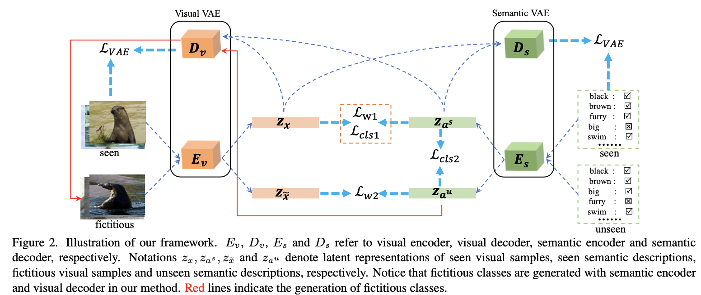
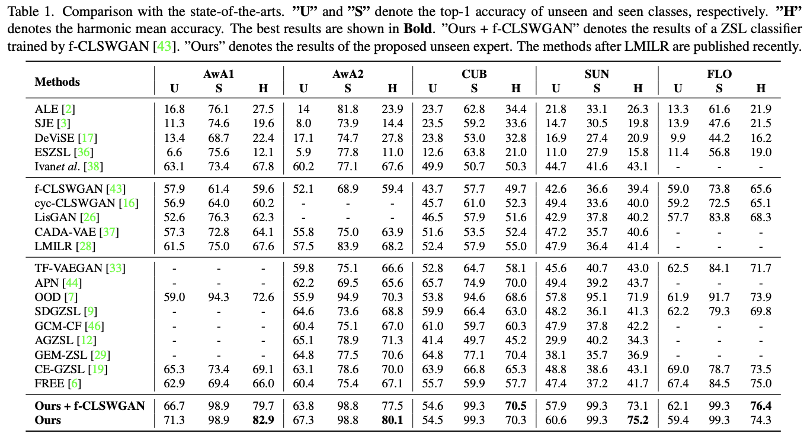
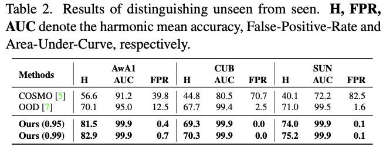

# Weekly Report

**Nov. 18**

## paper reading

### Zero-Shot Learning - The Good, the Bad and the Ugly

原来的数据集 SS(standard split) 分割中，有很多测试集的图像与ImageNet中的数据重合，而这些数据用来训练了ResNet。此时如果用ResNet提取图像特征用于Zero-shot测试，则结果通常会比那些未重叠的图像数据高，所以提出了一种新的数据分割方式PS( proposed split) 用于Zero-shot，保证了测试集部分与ImageNet没有重叠现象。

#### Datasets

| Dataset | Size   | Detail | Att  | Class | Class_train | Class_test |
| ------- | ------ | ------ | ---- | ----- | ----------- | ---------- |
| SUN     | medium | fine   | 102  | 717   | 580+65      | 72         |
| CUB     | medium | fine   | 312  | 200   | 100+50      | 50         |
| AWA     | medium | coarse | 85   | 50    | 27+13       | 10         |
| aPY     | small  | coarse | 64   | 32    | 15+5        | 12         |

> 100+50为一共150类用于测试，其中随机选择50类用于validation，其余同理

#### 分割方式对比

Training Time

| Dataset | Total_images | SS_train | SS_test | PS_train | PS_test |
| ------- | ------------ | -------- | ------- | -------- | ------- |
| SUN     | 14K          | 12900    | 0       | 10320    | 0       |
| CUB     | 11K          | 8855     | 0       | 7057     | 0       |
| AWA     | 30K          | 24295    | 0       | 19832    | 0       |
| aPY     | 15K          | 12695    | 0       | 5932     | 0       |

Evaluation  Time

| Dataset | Total_images | SS_train | SS_test | PS_train | PS_test |
| ------- | ------------ | -------- | ------- | -------- | ------- |
| SUN     | 14K          | 0        | 1440    | 2580     | 1440    |
| CUB     | 11K          | 0        | 2933    | 1764     | 2967    |
| AWA     | 30K          | 0        | 6180    | 4958     | 5685    |
| aPY     | 15K          | 0        | 2644    | 1483     | 7924    |

> 测试时，PS同时有训练集的类别和测试集的类别，因为在训练和测试课上评估准确性对于显示方法的泛化是至关重要的。

#### 实验结果

-  max-margin compatibility learning的方法结果好于attribute classifier learning 或者 hybrid methods。
- novelty detection scheme可以提高效果

### Distinguishing Unseen from Seen for Generalized Zero-shot Learning

#### motivation

- GZSL会把未见类识别为已见类，或者已见类识别为未见类，所以区分已见和未见领域是一种有效的解决方案

#### 常见方法

1. embedding methods
2. generative methods
3. domain-aware methods: 显式的区分可见域和不可见域

#### 文章方法

##### Wasserstein distance

对齐语义表示和视觉表示

$$
\mathcal{L}_{W1}=\inf_{\gamma\in \prod(p_{z_x}, p_{z_{a^s}})} \mathbb{E}_{(Z_x,Z_{a^s})\sim\gamma} [\|z_x-z_{a^s}\|]
\\
\mathcal{L}_{W2}=\inf_{\gamma\in \prod(p_{z_{\tilde{x}}}, p_{z_{a^u}})} \mathbb{E}_{(Z_{\tilde{x}},Z_{a^u})\sim\gamma} [\|z_{\tilde{x}}-z_{a^u}\|]
$$

优点：即使两个分布不重叠也能使用

##### VAE训练损失

$$
\begin{align}
\mathcal{L}_{VAE}&=
\mathbb{E}_{q_{\phi1}(z_x|x)}[\log p_{\theta_1}(x|z_x)]-\lambda KL(q_{\phi1}(z_x|x)\|p(z_x)) 
\\ &+ 
\mathbb{E}_{q_{\phi2}(z_{a^s}|a^s)}[\log p_{\theta_2}(a^s|z_{a^s})]-\lambda KL(q_{\phi2}(z_{a^s}|a^s)\|p(z_{a^s}))
\\
\\
\mathcal{L}_{cls1} &= -\mathbb{E}[p_{z_x}\log q_{z_x}]-\mathbb{E}[p_{z_{a^s}}\log q_{z_{a^s}}]
\end{align}
$$

##### fictitious sample

通过未见类的特征最终生成虚假未见类的潜在表示

$$
z_{\tilde{x}}=E_v(\tilde{x}), \ \tilde{x}=D_v(E_s(a^u))
$$

理论上通过最小化下式来训练分类器

$$
-\mathbb{E}[p_{z_x}\log q_{z_x}]-\mathbb{E}[p_{z_{\tilde{x}}}\log q_{z_{\tilde{x}}}]
$$

但是生成的样本可以有无穷种，难以确定哪一个用于训练，所以利用ZSL的不变的一面，用对应的语义表示代替视觉表示。将上式改为下式，

$$
\mathcal{L}_{cls2} = -\mathbb{E}[p_{z_{a^s}}\log q_{z_{a^s}}]-\mathbb{E}[p_{z_{a^u}}\log q_{z_{a^u}}]
$$

由于没有未见类的图像，所以只通过下式优化语义VAE

$$
\mathcal{L}_s =\mathbb{E}_{q_{\phi2}(z_{a^u}|a^u)}[\log p_{\theta_2}(a^u|z_{a^u})]-\lambda KL(q_{\phi2}(z_{a^u}|a^u)\|p(z_{a^u}))
$$

##### 整体训练策略

第一阶段：Aligning Seen Latent Representations

$$
\mathcal{L}_1 = \mathcal{L}_{VAE}+\lambda_{cr}\mathcal{L}_{cr}+\lambda_{cls}\mathcal{L}_{cls1}+\lambda_{w}\mathcal{L}_{W1}
$$

第二阶段：Generating Fictitious Classes

$$
\mathcal{L}_2 = \lambda_{w}\mathcal{L}_{W2} + \lambda_{cls}\mathcal{L}_{cls2}+ \lambda_{s}
$$

#### SOTA

- 对已见类的的识别很准备
- 分离可见和不可见类效果明显

#### Qustion

1. 方法为什么不算Generative?
